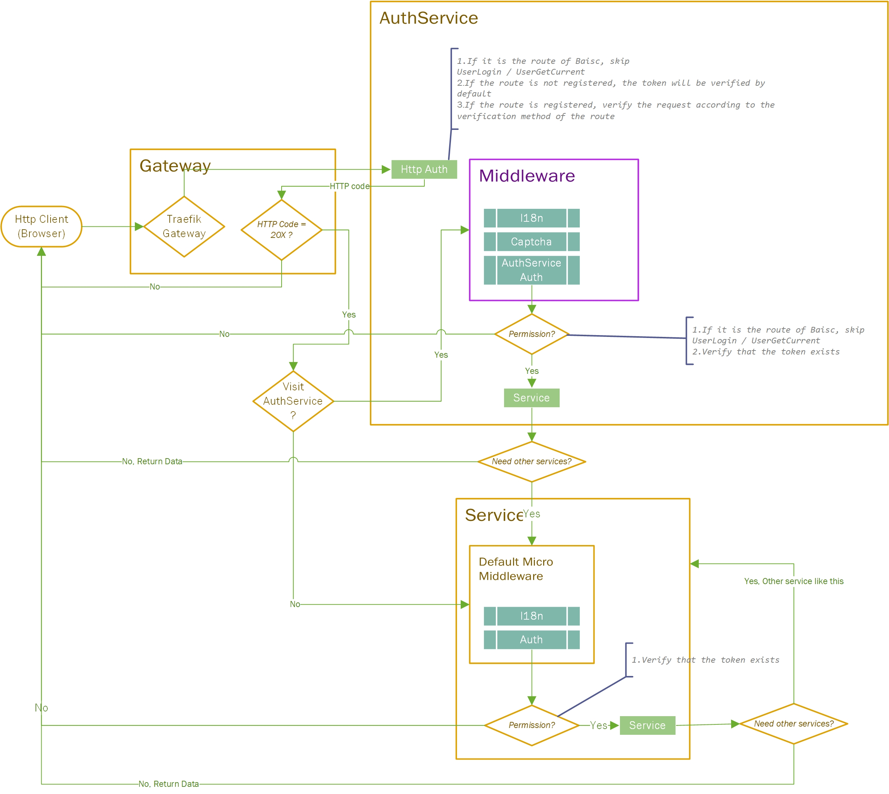

# EM-Auth

Englsih | [简体中文](./README_zh-CN.md)

## Introduction
This project is developed based on Etpmls-Micro.

This project is a general control center service that integrates RBAC0 authentication of users, roles, permissions, custom menus, clear cache, disk cleanup and other functions.



## Configuration

### EM configuration

Refer to Etpmls-Micro manual [EM Configuration](https://github.com/Etpmls/Etpmls-Micro#em-configuration)

### Gateway configuration

Configure in the configuration file service-discovery=>service=>http=>tag

```yaml
      tag: [
        "em.http.routers.em_AttachmentHttpService.entrypoints=web,websecure",
        "em.http.routers.em_AttachmentHttpService.rule=Host(`[YOUR_DOMAIN]`) && PathPrefix(`/api/attachment/`)",
        "em.http.routers.em_AttachmentHttpService.tls.certresolver=myresolver",
        "em.http.routers.em_AttachmentHttpService.middlewares=circuitBreaker_em-attachment@file,forwardAuth@file"
        "em.http.routers.em_AttachmentHttpService.service=em_AttachmentHttpService",

        "em.http.routers.em_AttachmentHttpService_Upload.entrypoints=web,websecure",
        "em.http.routers.em_AttachmentHttpService_Upload.rule=Host(`[YOUR_DOMAIN]`) && PathPrefix(`/storage/upload/`)",
        "em.http.routers.em_AttachmentHttpService_Upload.tls.certresolver=myresolver",
        "em.http.routers.em_AttachmentHttpService_Upload.service=em_AttachmentHttpService",

        "em.http.services.em_AttachmentHttpService.loadbalancer.passhostheader=true",
      ]
```

Replace [YOUR_DOMAIN] with your domain name

## Run

MySQL/MariaDB
```go
go run -tags=mysql main.go
```
PostgreSQL
```go
go run -tags=postgresql main.go
```